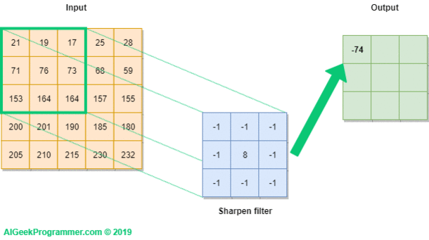
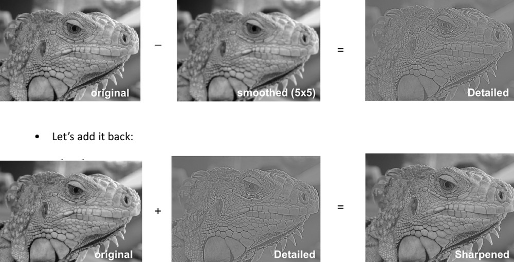
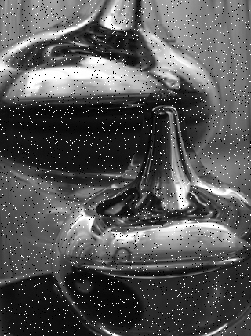
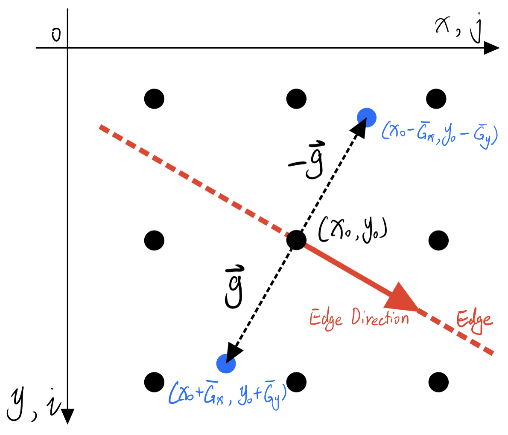
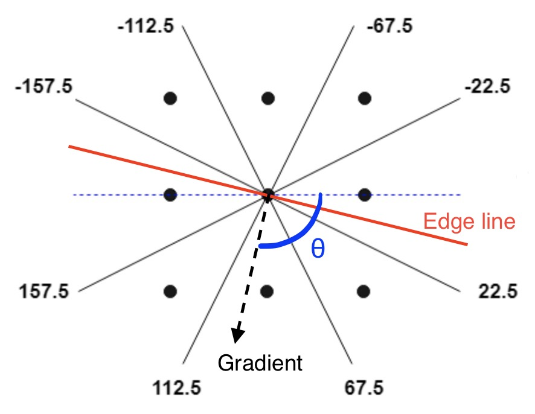
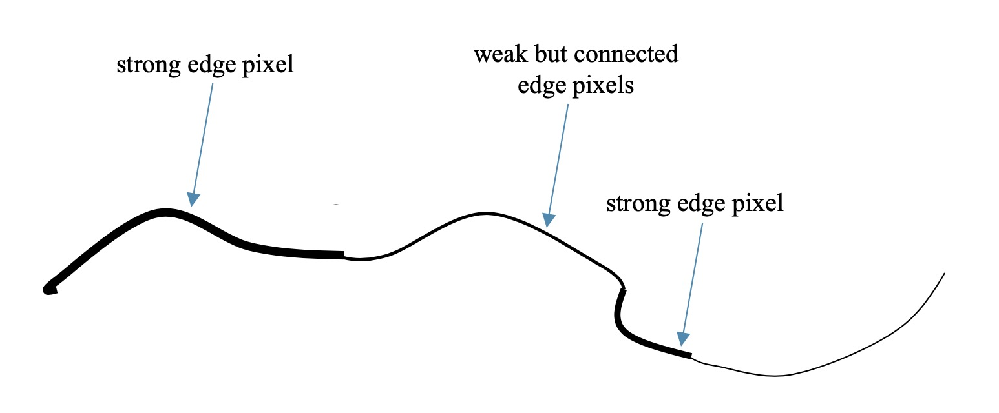
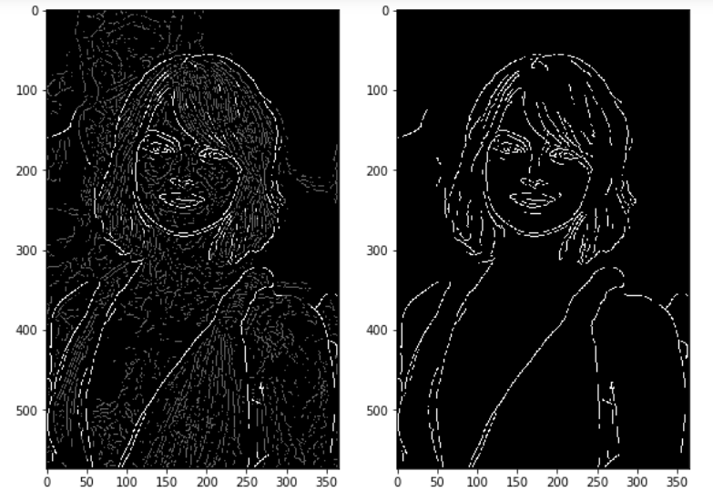
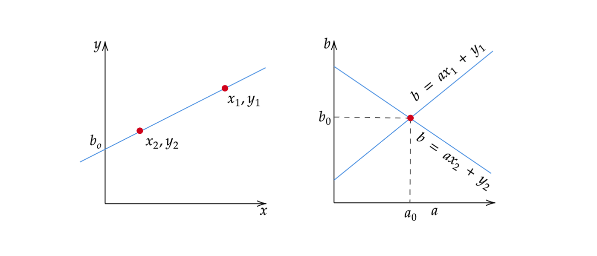
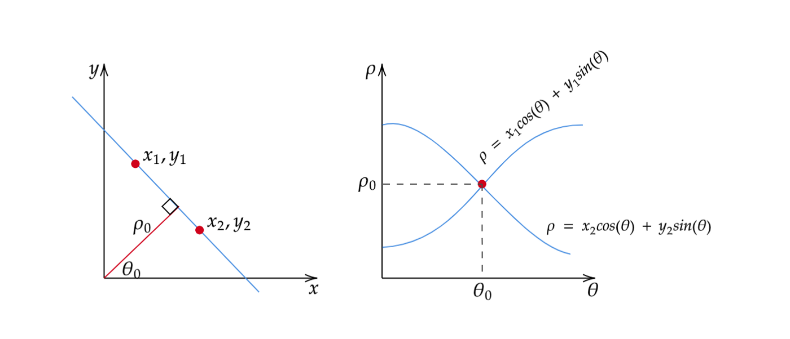
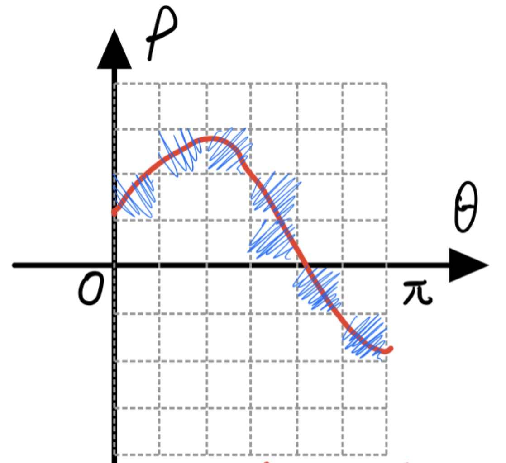

Please read this [setup](SetupPython.html) instruction before getting started.

<!-- ## Read & Write Image
[Pillow](https://pillow.readthedocs.io/en/stable/handbook/tutorial.html) (PIL) provides basic functions for image read & write. We can read/display/write image by `open`, `show` and `save` as follows:

```python
# load image
from PIL import Image
import numpy as np
img = Image.open('road.jpeg')

# display the image
img.show()

# save to file
img.save('road2.jpeg')
``` -->
# Image and Ndarray

Colour images in digital computer are represented as 3-dimensional arrays, which consist of height, width, and channels. Each element of the array is an 8-bit integer with a range of [0, 255]. The shape of the array is
$$(Height \times Width \times Channels ).$$

<center>

</center>

NumPy is a common library for performing mathematical operations on ndarrays in Python. Images can be represented as `numpy.ndarray` objects. `PIL.image` is used for reading and writing image files. Here is an example that demonstrates how to load, process, and save an image:

```python
from PIL import Image # pillow package
import numpy as np

img = Image.open('a.jpg')               # read image file
arr = np.asarray(img, dtype=np.float64) # convert to np.ndarray

# process the array here, e.g.
arr = arr/2

arr = arr.astype(np.uint8) # make sure dtype is uint8
img = Image.fromarray(arr) # convert back to PIL.image object
img.save('b.jpg')          # save to file
```

In order to assist with reading, writing, and displaying ndarrays, three helpful functions can be found in the files `code/filter.py` and `code/edge.py`:

- `read_img_as_array(file)`
- `save_array_as_img(arr, file)`
- `show_array_as_img(arr)`

# Manipulate Ndarrays
NumPy offers a wide range of operations for processing arrays, including:

- arithmetic operation
    - addition, subtraction, multiplication, and division,
    - sin/cos/tan/exp/power/log,
- indexing, slicing, stacking, concatenation, and shape manipulation
- matrix multiplication.

To gain a rapid understanding of NumPy, it is highly recommended to refer to the official [NumPy tutorial](https://numpy.org/devdocs/user/quickstart.html). Make sure you are familiar with these operators. Here, I will highlight some important parts of this tutorial that are particularly relevant to our assignment.

## Array attributes
Each ndarray object has three attributes -- `dtype`, `shape` and `ndim`.

- `dtype` indicates the data type of each element. e.g, int32 or float64.
- `shape` indicates the shape of the ndarray., e.g, the number of rows and columns of matrix, the length of a vector, etc. A color image usually has shape $(H, W, C)$.
- `ndim`  indicates the dimension of the array.
    - `ndim==0`: scalar,
    - `ndim==1`: vector,
    - `ndim==2`: matrix.
    - `ndim>=3`: multi-dimensional array, commonly referred to as a tensor.

```python
# Create array from list
a = np.array([[1, 2],
              [5, 8]])

a.shape # (2,2)
a.dtype # int32 -- 32-bit integer
a.ndim  # 2, means it is a matrix.
```
## Array creation
Create an all one matrix of shape 2x3:
```python
a = np.ones([2,3])  # all one matrix of shape 2x3
# array([[1., 1., 1.],
#        [1., 1., 1.]])
```
The default dtype is `float64` (double), you can specify other dtype:
```python
a = np.ones([2,3], dtype=np.int32)  # all one matrix of 32-bit integers
# array([[1, 1, 1],
#        [1, 1, 1]], dtype=int32)
```

Create all zero matrix of shape 3x2:
```python
a = np.zeros([3,2]) # all zero matrix of shape 3x2
# array([[0., 0.],
#        [0., 0.],
#        [0., 0.]])
```
Create matrix of shape 2x2 with unknown value:
```python
a = np.empty([2,2]) # matrix of shape 2x2 with unknown value
# e.g.
# array([[2.31584178e+077, 2.31584178e+077],
#        [2.96439388e-323, 6.93989086e-310]])
```
Create an array from 0 to 5, (6 elements in total):
```python
a = np.arange(6)
# array([0, 1, 2, 3, 4, 5])
```
## Arithmetic operation
Add by a number --- all elements will be added that number:

```python
a = np.array([[1, 2],
              [5, 6]])

a + 1   # addition
# result:
# array([[2, 3],
#        [6, 7]])

# subtraction, multiplication, and division are same.
a - 1.5 # subtraction
a * 5   # multiplication
a / 3   # division
```

Performing operations such as addition, subtraction, multiplication, and division with row/column vectors in NumPy will result in the vector being added, subtracted, multiplied, or divided with all the rows/columns in the array.
```python
# row vector
a + [2, 100]
# array([[  3, 102],
#        [  7, 106]])

# column vector
b = [[  2],
     [100]]
a + b
# array([[  3,   4],
#        [105, 106]])
```

Performing elementwise operations, such as addition, subtraction, multiplication, and division, on arrays can be achieved in NumPy by simply adding, subtracting, multiplying, or dividing arrays of the same shape.
```python
b = np.array([[10, 30],
              [20, 40]])
a + b   # element-wise addition
# array([[11, 32],
#        [25, 46]])
```

Performing various mathematical operations like sin/square/sqrt/power/exponiential/logarithm on each element:
```python
np.sin(a)      # a_ij = sin(a_ij), sine
np.square(a)   # a_ij = (a_ij)^2, square
np.sqrt(a)     # a_ij = √(a_ij), square root
np.power(a, 5) # a_ij = (a_ij)^5, arbitrary power
np.exp(a)      # a_ij = e^(a_ij), exponiential
np.log(a)      # a_ij = log(a_ij), logarithm
```

## Reshaping / indexing / slicing
We can modify an array's shape via `reshape` function:
```python
a = np.arange(9)
# array([0, 1, 2, 3, 4, 5, 6, 7, 8])

a = a.reshape(3,3)
# array([[0, 1, 2],
#        [3, 4, 5],
#        [6, 7, 8]])
```

To access a single element in an array, we can use indexing:
```python
a[0,1]     # zeroth row, first column

a[0,0] = 5 # assignment: a_00 = 5
```

To access a specific block of an array, we can use slicing:
```python
# select first two rows and first two columns
a[0:2, 0:2]
# array([[0, 1],
#        [3, 4]])

a[0, :] # zeroth row, colon means all.
a[:, 2] # second column

# select a single channel
R = arr[:, :, 0] # red channel
G = arr[:, :, 1] # green channel
B = arr[:, :, 2] # blue channel

# horizontal derivative calculation
diff = R[:, 1:] - R[:, :-1]
```

# Filter Basics

## Convolutional filters

__Convolution__ can be performed using the [`ndimage.convolve`](https://docs.scipy.org/doc/scipy/reference/generated/scipy.ndimage.convolve.html) function. Operations like Gaussian smoothing and Sobel filtering often involve convolution. Here is an example of how to use it:
$$\begin{bmatrix}
-1 & 1 \\
-1 & 1
\end{bmatrix} * gray$$
```python
from scipy import ndimage
weights = [[-1, 1],     # kernel / filter
           [-1, 1]]
diff = ndimage.convolve(gray, weights)
```
<center>

</center>

### Gaussian filter
You may manually define your own gaussian kernel and apply it using `ndimage.convolve`. Alternatively, you can directly utilize the [`scipy.ndimage.gaussian_filter`](https://docs.scipy.org/doc/scipy/reference/generated/scipy.ndimage.gaussian_filter.html) function provided by SciPy. By adjusting the `sigma` parameter, you can control the degree of blurring in the resulting image. A higher value of `sigma` will result in a blurrier image.

A 3x3 Gaussian filter:
$$\text{Gaussian}=\frac{1}{16} \times
\begin{bmatrix}
1 & 2 & 1 \\
2 & 4 & 2 \\
1 & 2 & 1
\end{bmatrix} =
\begin{bmatrix}
\frac{1}{16} & \frac{1}{8} & \frac{1}{16} \\
\frac{1}{8} & \frac{1}{4} & \frac{1}{8} \\
\frac{1}{16} & \frac{1}{8} & \frac{1}{16}
\end{bmatrix}$$

```python
# define the gaussian kernel manually
gauss = np.array([[1, 2, 1],
                  [2, 4, 2],
                  [1, 2, 1]])
gauss = gauss/gauss.sum() # normalize the sum to be 1
out = ndimage.convolve(gray, gauss)

# or use 'ndimage.gaussian_filter' function
# the bigger sigma is, the smoother output is.
from scipy import ndimage
out = ndimage.gaussian_filter(gray, sigma=3)

# for color image, we need to specify a sigma for each dimension.
# Especially, the sigma for channel should be zero.
rain = read_img_as_array('rain.jpeg')
print(rain.shape) # (H,W,C) = (1706, 1279, 3)
out = ndimage.gaussian_filter(rain, sigma=[3,3,0])
```
### Sharpening

Convolution can be utilized to sharpen images, which involves enhancing the image's details.

Sharpening formular:
$$\begin{equation}
\text{Detailed} = \text{Original} - \text{Blurred} \ \ \ \ (1)
\end{equation}$$
$$\begin{equation}
\text{Sharpened} = \text{Original} + \alpha * \text{Detailed} \ \ \ \ (2)
\end{equation}$$

In image sharpening, we have two parameters to consider. The first one is the `sigma` of Gaussian filter, and the second one is $\alpha$, which controls how much details you want to add back. Higher values of $\alpha$ result in a sharper output.

The resulting sharpened image obtained from equation (2) may have values exceeding the range of 0 to 255. We need to truncate them within the valid range of [0,255]:
```python
# the code for sharpening the image ...
sharpened = ...

# make sure all values in 'sharpened' falls into [0,255]
sharpened[sharpened < 0] = 0
sharpened[sharpened > 255] = 255
```

<center>

</center>

## Median filter

Apart from convolutional filters, there exist non-convolutional filters as well. One commonly used one is the median filter, which replaces each pixel with the median value of its surrounding neighborhood. The median filter is particularly effective in removing __salt-and-pepper noise__ (also known as impulse noise), which cannot be efficiently dealt with by Gaussian filters. The median filter only requires one parameter, which is the size of the neighborhood. A larger neighbourhood size usually eliminates noise more completely, but it can also result in a heavier distortion of the image.

When working with color images, it is necessary to apply the median filter to each channel individually.
<center>





<p>From left to right: (a) original. (b) denoised by 3x3 filter. (c) denoised by 9x9 filter.</p>
</center>


# Edge Detection via Canny Edge Detector
As you have learned, the Canny edge detector contains the following steps:

1. Gaussian Smoothing
2. Sobel Operator
3. Non-maximum suppression
4. Thresholding

__RGB to Greyscale__.
For the sake of simplicity, let's focus on grayscale images. First, we need to convert a colour image to grayscale. A commonly used formula for converting from RGB to grayscale is:
$$Y = 0.2989 \; R + 0.5870 \; G + 0.1140 \; B $$
```python
# you may use 'rgb2gray' function in 'edge.py' directly.
R = arr[:, :, 0] # red channel
G = arr[:, :, 1] # green channel
B = arr[:, :, 2] # blue channel
gray = 0.2989*R + 0.5870*G + 0.1140*B
```

## Sobel operator

Given an image $A$ of shape $(H, W)$, the Sobel operator computes the magnitude of the gradient of $A$ as follow:
$$
G_x = A*\begin{bmatrix}
+1 & 0 & -1 \\
+2 & 0 & -2 \\
+1 & 0 & -1
\end{bmatrix}
\qquad\qquad
G_y = A*\begin{bmatrix}
+1 & +2 & +1 \\
 0 &  0 &  0 \\
-1 & -2 & -1
\end{bmatrix}
$$

$$G = \sqrt{G_x^2 + G_y^2}$$

You need to complete the implementation yourself (completing the `sobel` function in file `code/edge.py`). To calculate squares and square roots, you may find the functions `np.square` and `np.sqrt` useful.

## Non-maximum suppression


The localization of the output from the Sobel operator is not precise. It tends to generate responses in multiple adjacent pixels, making it challenging to determine the exact location of edges. In order to address this, we intuitively suppress all non-maximum values in the gradient (G) by setting them to 0. This ensures that only the maximum values, indicating the occurrence of edges, are retained.

<center>



</center>

To compare each gradient with its neighbors along the perpendicular direction of edges, which is the same as the gradient direction, we begin by calculating the angle between the gradient (<span style="color:black">__black arrow__</span>) and the x-axis.


$$\theta = \arctan\left(\frac{Gy}{Gx}\right), \text{where } \theta \in [-180^\circ, 180^\circ].$$
```python
Gx = 1
Gy = 1
theta = np.arctan2(Gy, Gx) * 180 / np.pi
# 45.0
```
Subsequently, we determine the two neighboring elements $N_1$ and $N_2$ that need to be compared based on the value of theta.

- If $\theta \in [-22.5,+22.5] \cup [157.5, 180] \cup [-157.5, -180]$ then
$$ N_1 = G[i][j+1], \quad N_2 = G[i][j-1].$$
- If $\theta \in [22.5,67.5] \cup [-112.5,-157.5]$ then
$$ N_1 = G[i+1][j+1], \quad
N_2 = G[i-1][j-1].$$
- If $\theta \in [67.5,112.5] \cup [-67.5,-112.5]$ then
$$ N_1 = G[i+1][j], \quad
N_2 = G[i-1][j].$$
- If $\theta \in [112.5,157.5] \cup [-22.5, -67.5]$ then
$$ N_1 = G[i-1][j+1], \quad
N_2 = G[i+1][j-1].$$


Finally, any non-maximum edge points will be assigned a value of 0.

$$ G[i, j] := \left\{\begin{array}{l}
    0, & \text{if}\; G[i, j] < N_1; \\
    0, & \text{if}\; G[i, j] < N_2; \\
    G[i,j], & \text{elsewise.}
\end{array} \right. $$

## Hysteresis thresholding (double threshold)

Once non-maximum suppression is completed, the next step is to binarize the gradient magnitude. In the standard Canny edge detector, this involves applying two-level thresholding and conducting connectivity analysis. Since the gradient magnitude ranges from 0 to $255\sqrt{2}\approx361$, a suitable threshold can be chosen from the range of [0, 361]. For example:

```python
# threshold
low_thr= 180

# binarize G
G[G<=low_thr] = 0
```

When a pixel gradient exceeds the high threshold, it is considered a strong edge pixel. If the gradient is in range (low threshold, high threshold], it is classified as a weak edge pixel.
The final edgemap consists of two types of pixels:

1. all strong edge pixels, and
2. week edge pixels that are connected to some strong edge pixels.

<center>

</center>

<center>

</center>


# Hough Transform
Once we have obtained the edge image, the next step is to identify geometric shapes such as straight lines, circles, and ellipses from the edge map. A commonly used method for this purpose is the Hough Transform. In this section, we will illustrate how to detect straight lines using the Hough Transform.

## The Hough space
A line on an edge image is represented by the equation $y = ax + b$ (Hough, 1962). Each line on the edge image corresponds to a point in the Hough Space, with the line being defined by its slope $a$ and intercept $b$.
<center>

</center>

## An Alternate Way to Represent a Line
There is a limitation when representing lines in the form of $y = ax + b$. This is because the algorithm fails to detect vertical lines, as the slope $a$ becomes undefined or infinite (Leavers, 1992). 

To address this issue, a different representation called the normal line is used. $$\rho = cos(\theta)\;x + sin(\theta)\;y,$$ where $\rho$ represents the length of the normal line and $\theta$ denotes the angle between the normal line and the x-axis. The range of $\theta$ is $[0, \pi]$, and range of $\rho$ is $[-D, +D]$, where $D=\sqrt{H^2+W^2}$ represents the length of the diagonal of the image.
<center>

</center>

Given a point $(x_1, y_1)$, the parameters of all straight lines that pass through this point can be determined by the following equation:
$$\rho = cos(\theta)\;x_1 + sin(\theta)\;y_1,$$ which is a cosine curve in the Hough Space instead of a straight line (Leavers, 1992).
<!--
For a straight line with parameters $(\rho_0, \theta_0)$, if $n$ points $(x_1, y_1), (x_2, y_2), ..., (x_n, y_n)$ are all on this line, then the corresponding $n$ function curves in $\rho$-$\theta$ space
$$
\begin{matrix}
\rho = cos(\theta)\;x_1 + sin(\theta)\;y_1, \\
\vdots \\
\rho = cos(\theta)\;x_n + sin(\theta)\;y_n,
\end{matrix}
$$
intersect at point $(\rho_0, \theta_0)$.-->

## The Algorithm
Now, we can devise a voting procedure to determine the most likely straight lines, following these steps:

1. Discretize $\rho$-$\theta$ space into a grid of cells. This ensures that we have a finite number of possible candidates. A reasonable approach is to divide the range $[0, \pi]$ into 100-1000 equal parts for $\theta$. For $\rho$, a cell length of 1 is appropriate.
<center>

</center>

2. Create a 2D array called the accumulator to represent the Hough Space, with dimensions (num_rhos, num_thetas). Initialize all the values to zero.
3. For each edge pixel $(x, y)$, iterate through all possible values of $\theta$. Calculate the corresponding $\rho$ using the function $\rho = cos(\theta)\;x + sin(\theta)\;y$. Determine the indices of $\theta$ and $\rho$ in the accumulator, and increment the corresponding cell in the accumulator base on these indices.
4. Find the local maximum. Indentify the top $n$ cells in the accumulator, and return the corresponding $n$ pairs of $(\rho, \theta)$.
<center>

</center>


# Assignment

## Part I: Filter basics
Sharpen the image `data/rain.jpeg` and remove the rain drops using a median filter.

1. Define a 3*3 gaussian kernel manually and apply it to each pixel of `data/rain.jpeg` using 2D convolution to blur the image (not allow to use buildin functions like ndimage.convolve and ndimage.gaussian_filter). Save the result to `data/1.1_blur.jpg`. (1 points)

2. Implement your sharpening filter and perform it on `data/rain.jpeg`. Save the result as `data/1.2_sharpened.jpg`. To get an obvious result, you may choose a relatively large $\alpha$. (1 point)

3. Implement your own median filter and perform it on `data/rain.jpeg` to eliminate rain drops. Save the result to `data/1.3_derained.jpg`. To achieve a good deraining result, choose a filter size that is as small as possible yet large enough to effectively remove the raindrops. (Note that build-in functions like ndimage.median_filter are not allowed in this step) (2 points)


## Part II: Canny edge detector

Implement the Canny edge detector to detect edges in image `data/road.jpeg`. Your program should contain the following steps:

1. Convert the colour image into grayscale image, and save the result as `data/2.1_gray.jpg`. This is done because edge detection is a single channel operation. (0.5 points)
2. Perform Gaussian smoothing with an appropriate `sigma` value. You can use the built-in function ndimage.gaussian_filter to perform this operation.  Discuss how the `sigma` value affects the final edge detection results. (1 points)
3. Apply the sobel operator, save the x-gradient $G_x$, y-gradient $G_y$ and magnitude $G$ as `data/2.3_G_x.jpg`, `data/2.3_G_y.jpg` and `data/2.3_G.jpg`. (1.5 points)
4. Perform the non-maximum value suppression. Save the result as `data/2.4_supress.jpg`. (2 points)
5. Perform the hysteresis thresholding. Choose proper low and high thresholds, then binarize the suppression result using Hysteresis thresholding. Save the binarized result using the low threshold as `data/2.5_edgemap_low.jpg`, the result using the high threshold as `data/2.5_edgemap_high.jpg`, and the final result by Hysteresis thresholding as `data/2.5_edgemap.jpg`. Discuss how different thresholds affect the final edgemap. (3 points)

## Bonus: Hough transform

This part follows part II, where the Canny edge detector was applied to recognize straight lines in `data/2.5_edgemap.jpg`.

6. Conduct the Hough Transform. Save the resulting "voting" accumulator as `data/2.6_hough.jpg`. (0.5 point)
7. Determine the most possible straight lines (5-10). Draw these lines on the original image, then save as `data/2.7_detection_result.jpg`. To learn how to draw lines on image, refer to [this example](https://stackoverflow.com/questions/13053443/drawing-a-line-on-an-image-with-pil). (0.5 point)
8. Investigate the influence of the Hough Transform's parameter space resolution on line detection accuracy and computational efficiency. Use different resolution settings and observe the resulting detected lines. Save the detection result for different resolutions as `data/2.8_detection_result_high_resolution.jpg` and `data/2.8_detection_result_low_resolution.jpg`. Think about the trade-offs between resolution, accuracy, and computation time. (1.0 points)

## Submission instruction

OpenCV package `cv2` is __NOT__ allowed in this assignment.

Your submission should contain:

1. All intermediate results (images `data/*.jpg` you are asked to save) and the two discussions in Part II step 2 and step 5 (write in a `discussion.pdf` file).
2. Executable programs `code/edge.py` and `code/filter.py` that can reproduce your results.

Make sure to submit the results before __23:59 on March 17 (Sunday)__. Multiple submissions are allowed, but only the latest submission before the deadline will be evaluated.

# How to contact us

Please don't hesitate to reach out to us either through Microsoft Teams or via email if you have any questions or need further assistance.

`Zhong, Yongfeng (yongfeng7.zhong@connect.polyu.hk)`, 
`Zhao, Xiangyu (xiang-yu.zhao@connect.polyu.hk)`，
`Ouyang, mingxuan (mingxuan23.ouyang@connect.polyu.hk`.
